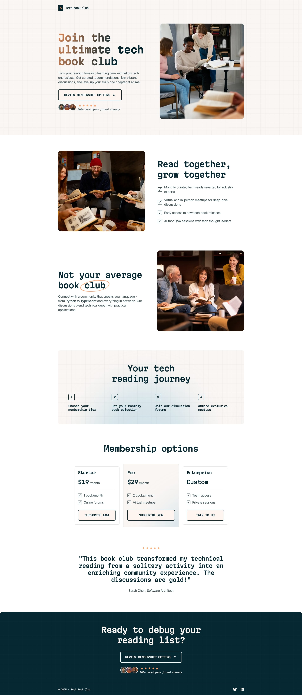

## Frontend Mentor Challenge 28 - Tech Book Club Landing Page

This is my solution to the [Tech Book Club Landing Page](https://www.frontendmentor.io/challenges/tech-book-club-landing-page-fZQidjHU73) challenge on [Frontend Mentor](https://www.frontendmentor.io/).

#

### Links. 🔗

- Live Site URL: https://tech-book-club-darkstarxdd.vercel.app/
- [PageSpeed Result](https://pagespeed.web.dev/analysis/https-tech-book-club-darkstarxdd-vercel-app/ifbvo3rt2l?form_factor=mobile)

#

### Screenshots of the Solution (Desktop & Mobile). 🔍

#

### Built with. 🔨

- NextJS
- TypeScript
- Tailwind
- [tailwind-variants](https://www.tailwind-variants.org/)

#

### New Things Learned. 🎓

- First time using NextJS on a project.

#

- Some tools i use - [DarkstarXDD/tools](https://gist.github.com/DarkstarXDD/4b1844eda12f34b667a0c36e05fcbdf9)
- My Frontend Mentor profile - [@DarkstarXDD](https://www.frontendmentor.io/profile/DarkstarXDD)
